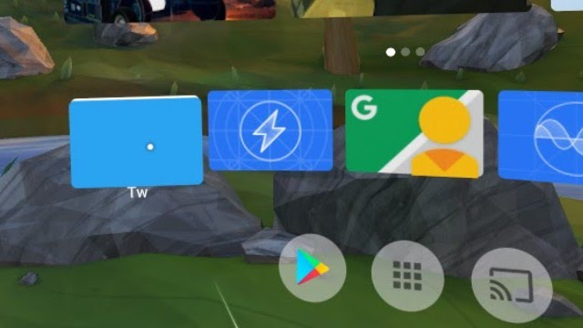

TwLancher
====
Twitter Launcher for Daydream standalone (Mirage Solo)

In Daydream standalone (Mirage Solo), can run non-vr-app in 2D View.
Open Google Play on browser, and install Twitter by remote install to Mirage Solo.
Launch this app in Daydream Launcher, launch Twitter in 2D View.

# License
MIT
